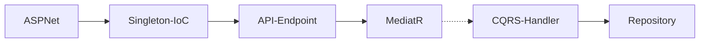

## Perfil

### Tony Henrique
Desenvolvimento de Software: 
Nuvem, Arquitetura de Sistemas e Bancos de Dados.

# Caminhões / Trucks
## Teste Prático - Web API

### Projeto para demonstração de conhecimentos necessários: 
- C# REST Web API com padrões de projeto
- Utilização do Entity Framework
- Utilização do ASP.NET Core para criação de Web Api com OpenAPI(Swagger)
- Utilização do padrão de projeto Repository
- Utilização do padrão de projeto Dependency Injection
- Utilização do padrão de projeto Inversion of Control
- Utilização do padrão de projeto CQRS
- Utilização do padrão DDD

## Diagrama arquitetural

**Web API**

.NET Minimal Web API utilizando CQRS, IoC, Repository, Domain: [ver código-fonte](WebAPI/Program.cs)

**Tela Inicial**

**Tela Administração**

**Editar Caminhão**

**Testes**

# More
## Live preview
https://tonyhenriquemeta.azurewebsites.net

## To run the tests

Install latest version of:
1) Google Chrome:
https://www.google.com/chrome

2) OpenQA.Selenium chromedriver.exe driver file must exist in the current directory or in a directory on the PATH environment variable. 
The driver can be downloaded at 
http://chromedriver.storage.googleapis.com/index.html
    

